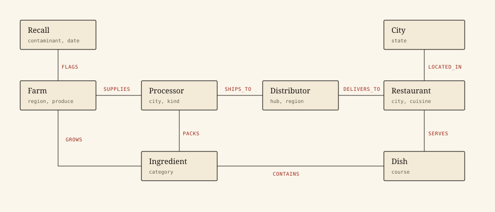
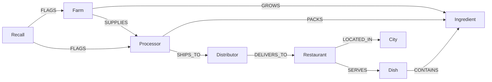
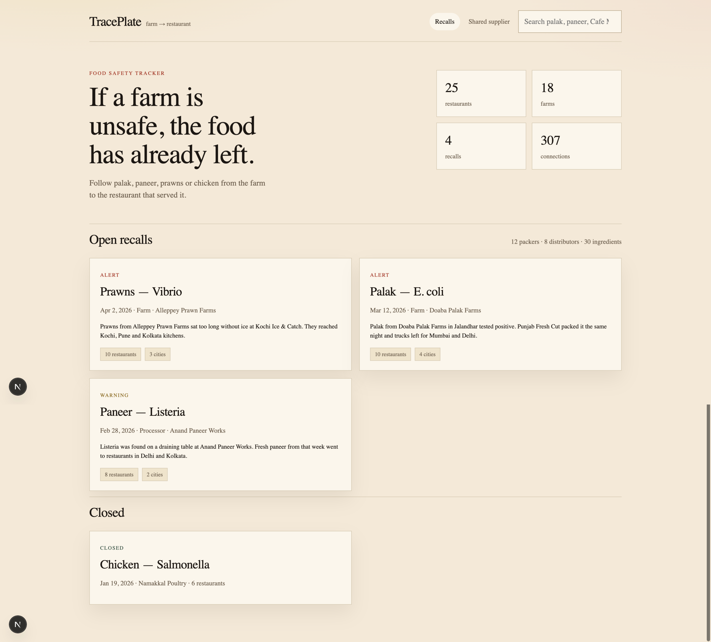
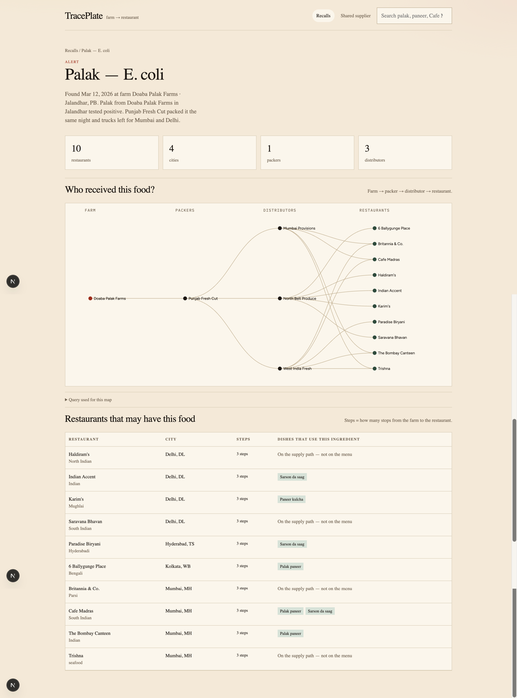
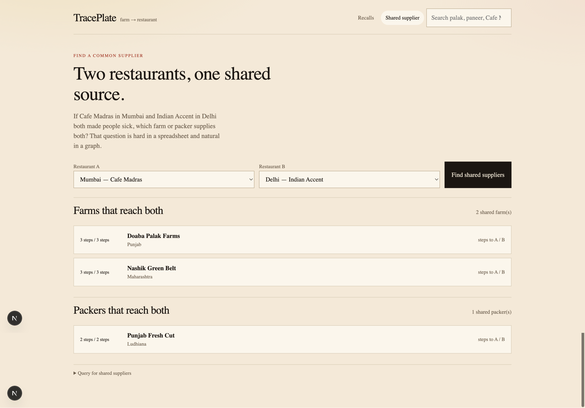

# TracePlate

Live demo: https://wexa-xi.vercel.app  
Screen recording: https://drive.google.com/file/d/1fqN1hqmn3Xih1PVj6adgx4hP27O4Hxm-/view

Built for the Wexa AI take-home: **CognoDB Cloud** as the database, **openCypher** over **Bolt**, official **Neo4j JavaScript driver**, Next.js for the UI.

---

## Use Case

TracePlate is a food-supply **outbreak tracer**. When a farm or packer is flagged in a recall, it walks the graph — farm → packer → distributor → restaurant — and shows every kitchen and dish that could have received the lot.

The demo graph is **Indian food**: palak, paneer, prawns and chicken, moving through Mumbai, Delhi, Bengaluru, Hyderabad, Kolkata, Chennai, Pune and Kochi.

---

## Why a Graph Database?

A food recall is not a row. It is a path.

The questions that matter after a positive test are:

1. **Blast radius.** Which kitchens sit downstream of this farm, two to four hops out, through whoever packed and trucked the lot?
2. **Reverse trace.** This kitchen served a sick table — what is the shortest supply path back to a flagged origin?
3. **Shared source.** Two kitchens in different cities reported the same illness. Which farm, packer, or distributor can reach *both*, at any depth?

In a relational schema those questions become recursive CTEs over a pile of join tables (`farm_processor`, `processor_distributor`, `distributor_restaurant`, …), then a second recursive CTE, then a join on ancestor ids. Change the hop depth and the SQL changes shape. Ask “shared source of *any* type” and you union several typed tables first.

In a graph the same questions are the data model:

```cypher
MATCH path = (origin)-[:SUPPLIES|SHIPS_TO|DELIVERS_TO*1..6]->(kitchen:Restaurant)
```

Variable-length traversal, mixed node types on one path, and ancestor intersection are native. That is why this use case belongs in CognoDB rather than Postgres.

---

## Data Model Diagram





| Label | What it is | Properties |
| --- | --- | --- |
| `Farm` | Growing or harvest origin | name, city, state, region, produceType, certification |
| `Processor` | Packhouse / creamery / plant | name, city, state, kind |
| `Distributor` | Regional wholesaler | name, region, hub |
| `Restaurant` | Kitchen on the graph | name, city, state, cuisine, neighborhood |
| `Dish` | Menu item | name, course |
| `Ingredient` | What the dish contains | name, category, perishable |
| `Recall` | Investigation | title, contaminant, severity, date, status, summary |
| `City` | For “cities at risk” | name, state |

Relationship types: `FLAGS`, `GROWS`, `SUPPLIES`, `PACKS`, `SHIPS_TO`, `DELIVERS_TO`, `SERVES`, `CONTAINS`, `LOCATED_IN`.

The seed loads four investigations, including:

- **Palak — E. coli** flagged at Doaba Palak Farms (Jalandhar). Walks through Punjab Fresh Cut onto Mumbai and Delhi trucks.
- **Paneer — Listeria** flagged at Anand Paneer Works. Hits Delhi and Kolkata restaurants.
- **Prawns — Vibrio** flagged at Alleppey Prawn Farms. Reaches Kochi, Pune and Kolkata.

A good pair for **Shared supplier**: Cafe Madras (Mumbai) and Indian Accent (Delhi). They share Punjab Fresh Cut / West India–North Belt paths.

---

## Main Queries Explained

All Cypher is in [`lib/cypher.ts`](lib/cypher.ts). Every call is **parameterised** (`$id`, `$q`, `$idA`, `$idB`) via `driver.executeQuery` — no string concatenation.

| Query | Hops | Why it is here |
| --- | --- | --- |
| `blastRadiusEdges` / `blastRadiusKitchens` | 1–6 | Multi-hop blast radius from a flagged origin, plus dishes that contain ingredients grown or packed there. |
| `kitchenRecallPaths` | 1–6 | Shortest variable-length path from each recall origin to one kitchen (`head(collect(path))` after ordering by `length(path)` — no `shortestPath()`, which is outside openCypher). |
| `sharedSources` | 1–6 each side | **Awkward for SQL:** two kitchens, every upstream Farm/Processor/Distributor that can reach both, with hop distance to each. |
| `search` | — | Parameterised `CONTAINS` over mixed labels. |

Open any investigation or the Shared source page and expand **Cypher used…** to see the exact statement the driver ran.

---

## Project structure

```
app/            Next.js App Router pages + /api/search, /api/compare, /api/health
components/     Shell, search, layered SVG graph, compare form, empty/error states
lib/cypher.ts   Parameterised Cypher only
lib/neo4j.ts    Official neo4j-driver singleton, Integer coercion, 503 wrapping
lib/queries.ts  Maps records into UI types
scripts/seed.mjs  Idempotent load (clears, then MERGE)
```

Connection details are read from `COGNODB_URI`, `COGNODB_USERNAME`, and `COGNODB_PASSWORD`. They are never committed.

If CognoDB is down, pages render a readable error instead of crashing; `/api/health` returns 503.

---

## How to Create a CognoDB Instance

1. Sign up at [https://console.cognodb.com/signup](https://console.cognodb.com/signup) (free tier, no credit card).
2. Create a free **c0** instance and pick a region. It provisions in under a minute.
3. Copy the URI (`bolt+s://<instance-id>.databases.cognodb.cloud`) and the password for user `cognodb`. The password is shown **once**.

If TLS verification fails against CognoDB’s certificate, switch the scheme to `bolt+ssc://`.

## Setup / Run Instructions

```bash
cp .env.example .env.local
# paste COGNODB_URI and COGNODB_PASSWORD

npm install
npm run seed
npm run dev
```

Open [http://localhost:3000](http://localhost:3000).

Seed is safe to re-run: it deletes the previous graph, then `MERGE`s this dataset.

### Hosted demo (Vercel)

The graph lives in CognoDB, not on the app host. Seed once against your instance, then deploy the Next.js app with the same env vars.

```bash
npx vercel
```

In the Vercel project: Settings → Environment Variables → add `COGNODB_URI`, `COGNODB_USERNAME=cognodb`, `COGNODB_PASSWORD`. Redeploy.

Keep the CognoDB instance running until Wexa has reviewed.

---

## UI screenshots

### Home — open recalls



Palak, paneer and prawns as open recalls. Chicken is closed.

### Palak — who received this food



Doaba Palak Farms → Punjab Fresh Cut → distributors → restaurants in Mumbai, Delhi, Kolkata and Hyderabad.

### Shared supplier



Cafe Madras (Mumbai) and Indian Accent (Delhi) share Doaba Palak Farms, Nashik Green Belt and Punjab Fresh Cut.

---

## Screen Recording

https://drive.google.com/file/d/1fqN1hqmn3Xih1PVj6adgx4hP27O4Hxm-/view

Walkthrough (~90 seconds):

1. Home: three open recalls, counts from the live graph.
2. Open **Palak — E. coli**. Show the farm → packer → restaurant map.
3. Click **Cafe Madras**. Show the path back to the farm.
4. **Shared supplier**: Cafe Madras and Indian Accent. Point at the shared packer.

---

## Tech stack (as specified)

| Layer | Choice |
| --- | --- |
| Database | CognoDB Cloud (c0), Bolt 5.x, openCypher |
| Driver | Official `neo4j-driver` for JavaScript |
| App | Next.js 15 (App Router) + TypeScript |
| Hosting | Vercel free tier (app) + CognoDB (data) |
